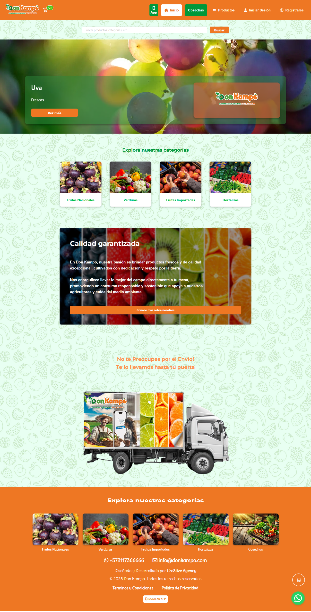
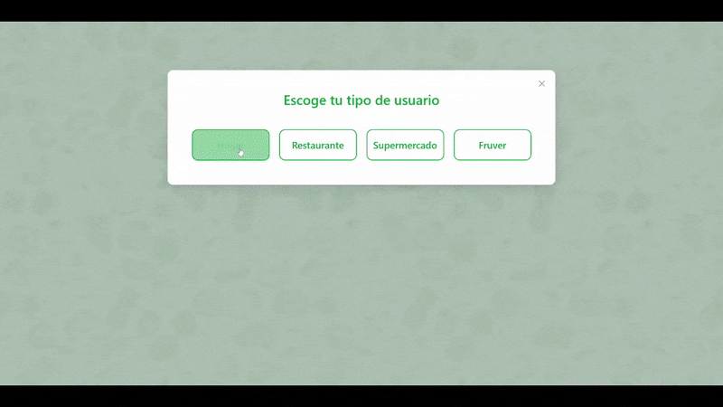
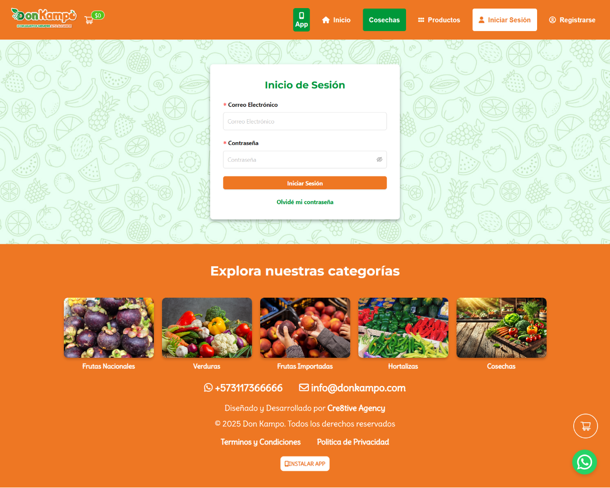
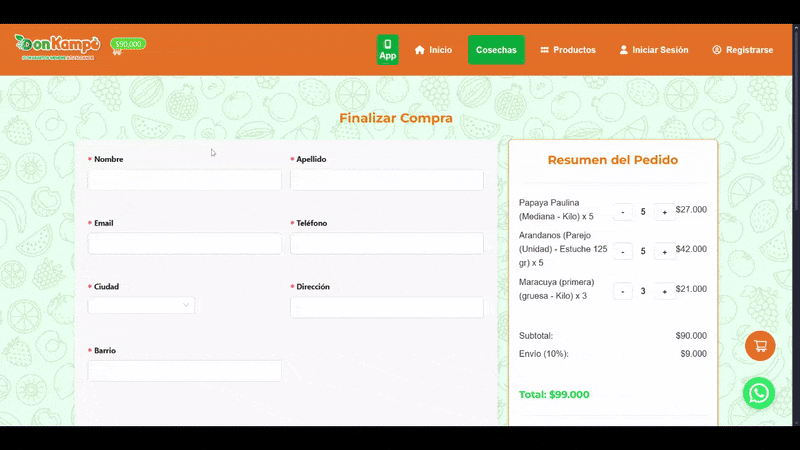
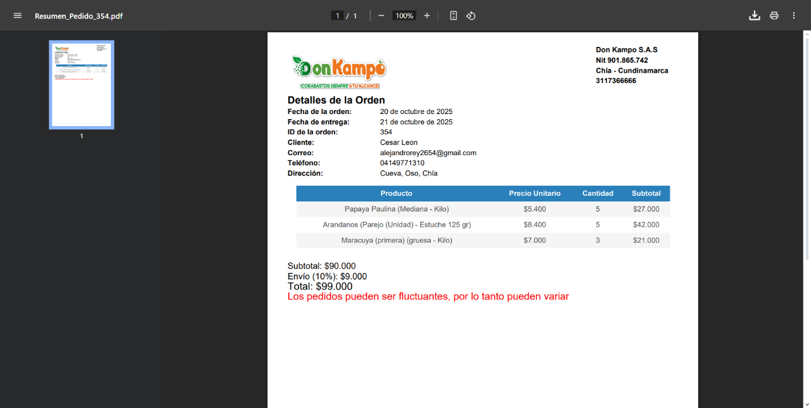
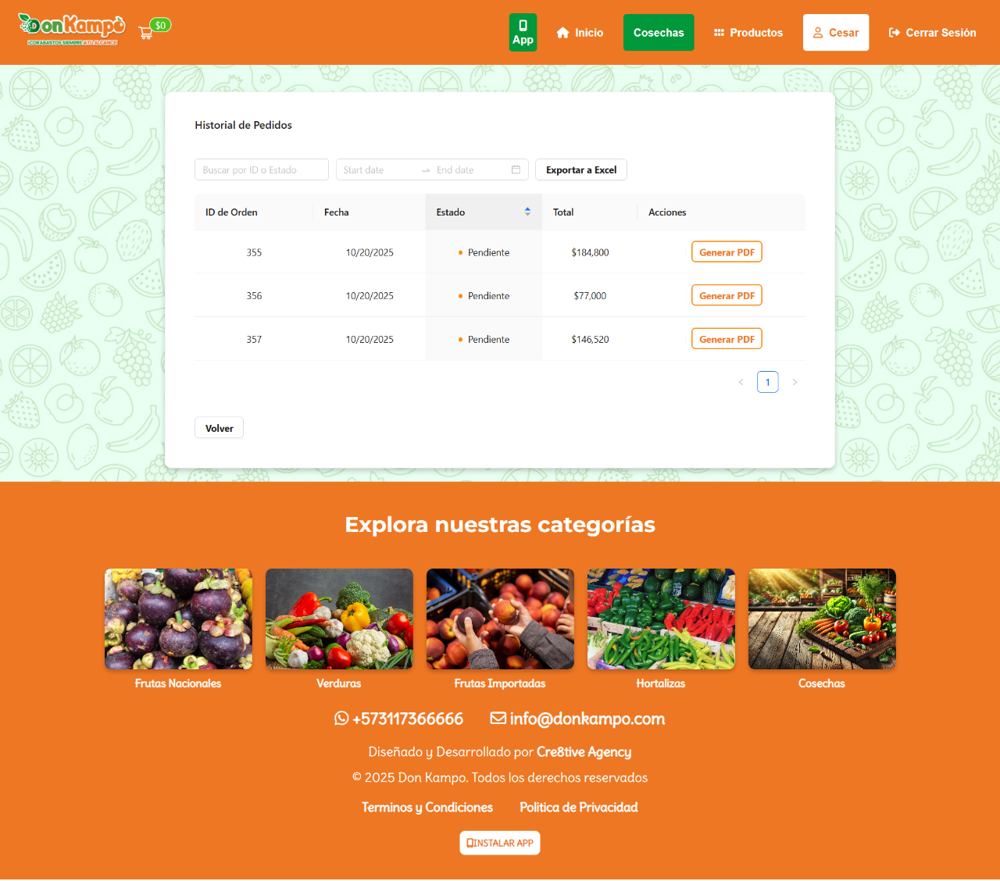
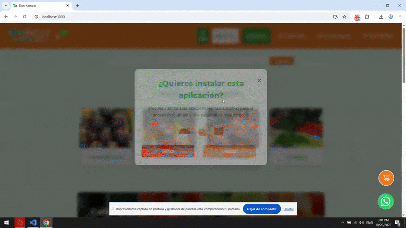

# 🛒 DonKampo – Case Study on Distribution SaaS Platform

A case study of a wholesale and distribution SaaS built for multi-client commerce in Colombia, featuring custom pricing, admin panel, PDF invoices, and PWA support.

---

## 🌍 Overview

DonKampo was developed as a custom commerce and distribution platform designed for both B2B and B2C operations.

The system allows clients to:

Register and log in based on their business type

Search and browse tailored product catalogs

View product variations (and sub-variations)

Manage shopping carts and complete checkout

Review their order history

Download invoices as PDFs

Export their order records to Excel

Admins have access to a dedicated dashboard for managing users, orders, sales, commissions, shipping costs, and product catalogs — all with visual reports and Excel exports.

---

## ✨ Features

### 🧑‍🤝‍🧑 Client-Side

- 👤 Multi-client registration & login (household, restaurant, fruver, supermarket)
- 🔍 Product search and filtering
- 🧩 Product variations and nested variations
- 🛒 Shopping cart and checkout page
- 💰 Dynamic pricing per client type
- 📄 PDF invoice generation for every order
- 📊 Order history with Excel export
- 🧾 Editable user profile and order tracking
- 📲 PWA support (installable on mobile & desktop)

### 🛠 Admin Dashboard

- 🧍‍♂️ User management by client type (with user counts & email view)
- 📦 Full product management (create, edit, delete)
- ⬆️ Bulk product import/update via Excel
- 📉 Sales reporting with charts and Excel export
- ⚙️ Configurable shipping commissions per client type
- 📢 Advertising campaign management (create, edit, delete)
- 💼 Role-based access and modular navigation

---

## 📸 Showcase

### 🏠 Homepage



### 🔐 Register / Login




### 🛒 Ordering


### 🛍 Checkout



### 📃 Order




### ⚡ PWA



---

## 🛠 Tech Stack

- **Frontend:** React.js, Vite, CSS3
- **Backend:** Node.js, Express.js
- **Database:** MySQL
- **Authentication:** JWT
- **File Handling:** Multer (images & products)
- **PDF:** Invoice generation at checkout
- **Excel:** Reporting & product import/export
- **PWA:** Mobile/desktop installation mode
- **Admin Panel:** Full management of users, products, ads, and reports

---

## 📂 Project Structure

```text
client/
 ├── public/
 ├── src/
 │   ├── assets/
 │   ├── components/
 │   ├── css/
 │   ├── fonts/
 │   ├── utils/
 │   ├── App.jsx
 │   └── main.jsx
 └── index.html

server/
 ├── src/
 │   ├── config/
 │   ├── controllers/
 │   ├── database/
 │   ├── helpers/
 │   ├── middlewares/
 │   ├── migration/
 │   ├── routes/
 │   └── index.js
 └── web/
     └── index.ejs
```

---

## ⚙️ Installation & Setup

⚠️ This project was developed for a private client and is not publicly available.

---

## 📖 Case Study

I joined the project halfway through its development, completing the remaining features and working on both frontend and backend improvements.

The main challenge was ensuring seamless integration between multi-client roles, dynamic product catalogs, PDF invoice generation, and admin reporting tools.

The final product became a fully functional SaaS-like platform, optimized for distribution companies with scalability in mind.

---

## 📈 Learnings & Insights

- Multi-client SaaS platforms benefit from dynamic catalog and pricing structures per user type
- PDF invoice generation and Excel reporting improve operational efficiency for distribution
- Role-based access control ensures data integrity and reduces operational errors
- Integrating frontend and backend features mid-project requires careful planning for consistent UX
- PWA support and responsive design enhance usability for both mobile and desktop users

---

## 📜 License

This project was developed for a private client and is **not open-source**.
